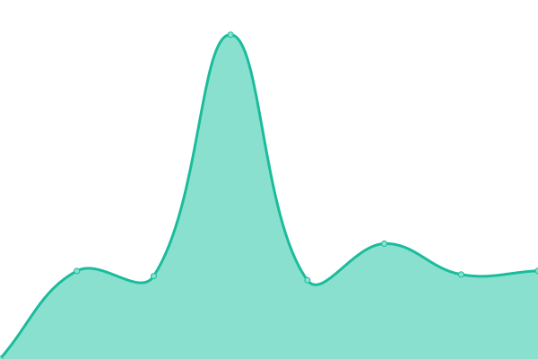
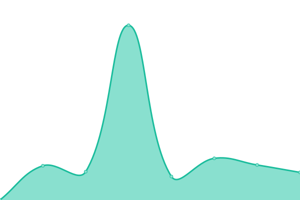

# [📈 Live Status](https://status2.fcu.mikuc.at): <!--live status--> **🟩 All systems operational**

This repository contains the open-source uptime monitor and status page for [mikucat0309](https://status2.fcu.mikuc.at), powered by [Upptime](https://github.com/upptime/upptime).

With [Upptime](https://upptime.js.org), you can get your own unlimited and free uptime monitor and status page, powered entirely by a GitHub repository. We use [Issues](https://github.com/mikucat0309/upptime/issues) as incident reports, [Actions](https://github.com/mikucat0309/upptime/actions) as uptime monitors, and [Pages](https://status2.fcu.mikuc.at) for the status page.

<!--start: status pages-->
<!-- This summary is generated by Upptime (https://github.com/upptime/upptime) -->
<!-- Do not edit this manually, your changes will be overwritten -->
<!-- prettier-ignore -->
| URL | Status | History | Response Time | Uptime |
| --- | ------ | ------- | ------------- | ------ |
|  [Official Website](https://www.fcu.edu.tw/) | 🟩 Up | [official-website.yml](https://github.com/mikucat0309/upptime/commits/HEAD/history/official-website.yml) | 

 3834ms
     
 | 

<a href="https://status.fcu.mikuc.at/history/official-website">100.00%</a>
    

|  [iLearn 2.0](https://ilearn2.fcu.edu.tw/) | 🟩 Up | [i-learn-2-0.yml](https://github.com/mikucat0309/upptime/commits/HEAD/history/i-learn-2-0.yml) | 

 1896ms
     
 | 

<a href="https://status.fcu.mikuc.at/history/i-learn-2-0">97.70%</a>
    

|  [MyFCU](https://myfcu.fcu.edu.tw/) | 🟩 Up | [my-fcu.yml](https://github.com/mikucat0309/upptime/commits/HEAD/history/my-fcu.yml) | 

 1602ms
     
 | 

<a href="https://status.fcu.mikuc.at/history/my-fcu">100.00%</a>
    

|  [NID OAuth](https://opendata.fcu.edu.tw/) | 🟩 Up | [nid-o-auth.yml](https://github.com/mikucat0309/upptime/commits/HEAD/history/nid-o-auth.yml) | 

 1959ms
     
 | 

<a href="https://status.fcu.mikuc.at/history/nid-o-auth">100.00%</a>
    

|  [Online Judge](https://oj.fcu.edu.tw/) | 🟩 Up | [online-judge.yml](https://github.com/mikucat0309/upptime/commits/HEAD/history/online-judge.yml) | 

 1547ms
     
 | 

<a href="https://status.fcu.mikuc.at/history/online-judge">100.00%</a>
    

<!--end: status pages-->

[**Visit our status website →**](https://status2.fcu.mikuc.at)

## 📄 License

- Powered by: [Upptime](https://github.com/upptime/upptime)
- Code: [MIT](./LICENSE) © [mikucat0309](https://status2.fcu.mikuc.at)
- Data in the `./history` directory: [Open Database License](https://opendatacommons.org/licenses/odbl/1-0/)
